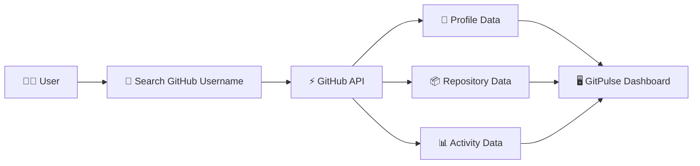

# ⚡ GitPulse

<p align="center">
  
</p>

<p align="center">
  
</p>

<p align="center">
  <a href="https://github.com/JEETJM/GitPulse">
    
  </a>
  <a href="https://github.com/JEETJM/GitPulse/forks">
    
  </a>
  <a href="https://github.com/JEETJM/GitPulse/issues">
    
  </a>
  
</p>

<p align="center">
  <strong>GitPulse</strong> is a modern GitHub explorer designed to turn GitHub profile and repository data into a clean, interactive and meaningful experience.
</p>

---

## ✨ Why GitPulse?

GitHub contains a huge amount of developer data, but finding the right information quickly can be difficult.

**GitPulse** brings important GitHub information together in one place.

```text
🔎 Search       → Find GitHub users
👤 Profile      → Explore developer profiles
📦 Repositories → Discover projects
📊 Activity     → Understand GitHub activity
⚡ Insights     → Get a quick developer overview
```

---

## 🚀 Features

| Feature                | Description                                      |
| ---------------------- | ------------------------------------------------ |
| 🔍 GitHub User Search  | Search GitHub users instantly                    |
| 👤 Developer Profiles  | View profile information in a clean UI           |
| 📦 Repository Explorer | Explore public repositories                      |
| ⭐ Repository Stats     | Stars, forks, language and other details         |
| 📈 Activity Insights   | Understand developer activity                    |
| 🔗 GitHub Integration  | Direct links to GitHub profiles and repositories |
| 📱 Responsive UI       | Works across desktop, tablet and mobile          |
| ⚡ Fast Experience      | Optimized for smooth navigation                  |

---

## 🖥️ Preview

<p align="center">

<!-- Replace this with your actual screenshot -->


</p>

> 💡 Replace the placeholder above with your actual GitPulse screenshot.

---

## 🧠 How GitPulse Works



---

## 🛠️ Tech Stack

<p align="center">


</p>

### Frontend

* ⚛️ React
* ⚡ Vite
* 🟨 JavaScript
* 🎨 HTML5
* 🎨 CSS3

### API

* 🐙 GitHub REST API

### Development Tools

* Git
* GitHub
* VS Code
* npm

---

## 📂 Project Structure

```text
GitPulse/
│
├── public/
│
├── src/
│   ├── assets/
│   ├── components/
│   ├── pages/
│   ├── services/
│   ├── App.jsx
│   ├── main.jsx
│   └── index.css
│
├── .gitignore
├── package.json
├── vite.config.js
└── README.md
```

---

## ⚙️ Getting Started

### 1️⃣ Clone the repository

```bash
git clone https://github.com/JEETJM/GitPulse.git
```

### 2️⃣ Navigate to the project

```bash
cd GitPulse
```

### 3️⃣ Install dependencies

```bash
npm install
```

### 4️⃣ Start development server

```bash
npm run dev
```

Then open the local development URL shown by Vite.

---

## 🔐 GitHub API

GitPulse uses the GitHub API to retrieve public GitHub information.

The application can work with public GitHub data such as:

```text
User Profile
     ↓
Repositories
     ↓
Repository Statistics
     ↓
Languages
     ↓
GitHub Activity
```

> ⚠️ GitHub API rate limits may apply depending on how requests are made.

---

## 🎯 Roadmap

* [x] GitHub user search
* [x] Profile exploration
* [x] Repository listing
* [x] Responsive interface
* [ ] Advanced GitHub analytics
* [ ] Contribution heatmap
* [ ] Repository comparison
* [ ] Developer comparison
* [ ] GitHub activity timeline
* [ ] Dark / light theme
* [ ] AI-powered developer insights
* [ ] Export profile analytics

---

## 🌟 Future Vision

GitPulse aims to evolve from a simple GitHub explorer into a complete **developer analytics platform**.

```text
GitHub Profile
      │
      ▼
┌───────────────────┐
│      GitPulse     │
├───────────────────┤
│ Profile Analytics │
│ Repository Stats  │
│ Contribution Data │
│ Developer Insights│
│ Project Discovery │
└───────────────────┘
      │
      ▼
 Better Developer Insights 🚀
```

---

## 🤝 Contributing

Contributions are welcome!

```bash
# Fork the repository

# Create your feature branch
git checkout -b feature/amazing-feature

# Commit your changes
git commit -m "Add amazing feature"

# Push the branch
git push origin feature/amazing-feature

# Open a Pull Request
```

---

## 📌 Branch Strategy

GitPulse keeps development work separated from the main branch.

```text
main
 │
 └── project-libraries
       │
       ├── New Features
       ├── UI Improvements
       ├── Bug Fixes
       └── Development
```

---

## 👨‍💻 Developer

<p align="center">


</p>

<h3 align="center">Jeet Mondal</h3>

<p align="center">
Full Stack Developer • MERN Stack • AI Enthusiast
</p>

<p align="center">
  <a href="https://github.com/JEETJM">
    
  </a>
</p>

---

## ⭐ Support

If you found GitPulse useful, consider giving the repository a ⭐.

<p align="center">

### ⚡ Star it. Explore it. Build with it.

</p>

---

<p align="center">
  
</p>

<p align="center">
  <sub>Built with ❤️ and lots of ☕ by Jeet Mondal</sub>
</p>
